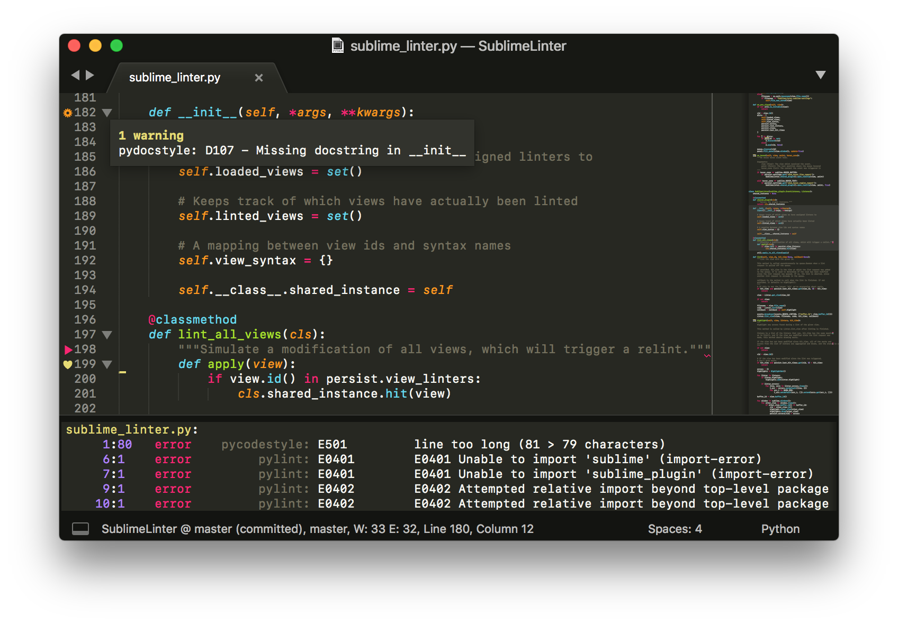

Welcome to SublimeLinter
==========================

SublimeLinter is a plugin for `Sublime Text <https://www.sublimetext.com/>`_ that provides a framework for linting code.

SublimeLinter repo and issues can be reached on `GitHub <https://github.com/SublimeLinter/SublimeLinter>`_.

.. toctree::
    :caption: User Documentation
    :name: toc_user

    installation
    settings
    linter_settings
    troubleshooting

.. toctree::
    :caption: Developer Documentation
    :name: toc_developer

    gutter_themes
    linter_plugin
    linter_attributes
    linter_methods
    python_linter
    ruby_linter
