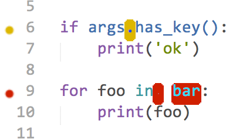
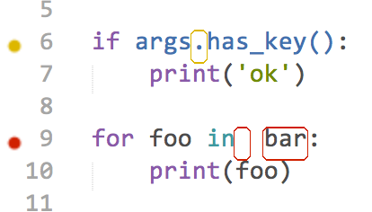
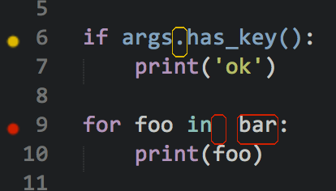
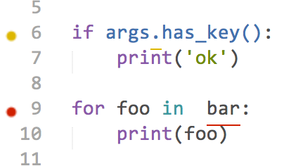
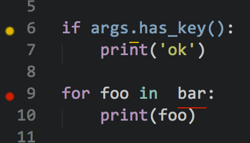
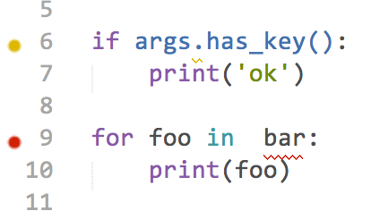
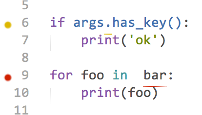
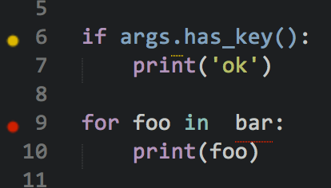

.. include:: defines.inc

Mark Styles
============
When linting is done, |sl| marks errors in three ways: the suspect code itself is marked, the line on which the code occurs is marked :doc:`in the gutter <gutter_themes>`, and the status bar (at the bottom of the window) gives information on the errors based on the current selection. Code marks and gutter marks can be configured separately.

Status bar info
---------------
If there are linting errors in the current view, the status bar is updated as you change the selection.

- If the first character in the first selection **is not** on a line with an error, the status bar will indicate the total number of errors, for example “7 errors”.

- If the first character in the first selection **is** on a line with an error, the status bar will indicate the range of errors on that line, along with all of the error messages for those errors, separated by semicolons, for example “2-3 of 7 errors: Multiple spaces after keyword; Undefined name 'bar'”.

Code mark styles
----------------
There are five different code mark styles available: **fill**, **outline**, **solid underline**, **squiggly underline**, and **stippled underline**. In addition, you can choose to turn code marks off completely if you just want to see gutter marks.

There are actually two types of marks: errors and warnings. Most linters classify the issues they find as errors or warnings, and the linter plugins in turn decide whether to report them to |sl| as errors or warnings. Errors and warnings are drawn in separate, :ref:`configurable colors <error_color>`. This helps you to visually identify which marks are errors and which are warnings.

Which mark style you use is a matter of taste. Below are samples of each mark style using a light and dark color scheme (`Tomorrow and Tomorrow-Night`_). The colored dots on the left are the default gutter marks.

.. note::

   As you can see below, there is currently a limitation in |st| that prevents underlines from drawing under non-word characters (such as whitespace). Take this into account when choosing a mark style.

fill
~~~~~~~

.. image:: images/marks-fill-dark.png
   :width: 207
   :height: 118

----

outline
~~~~~~~

----

solid underline
~~~~~~~~~~~~~~~~

----

squiggly underline
~~~~~~~~~~~~~~~~~~~

.. image:: images/marks-squiggly-dark.png
   :width: 207
   :height: 118

----

stippled underline
~~~~~~~~~~~~~~~~~~~

----

.. _choosing-a-mark-style:

Choosing a mark style
---------------------
There are three ways to select a mark style:

**Command Palette**
:raw-html:` `
Bring up the |_cmd| and type :kbd:`mark`. Among the commands you should see ``SublimeLinter: Choose Mark Style``. If that command is not highlighted, use the keyboard or mouse to select it. A list of the available mark styles appears with the current mark style highlighted. Type or click to select the mark style you would like to use.

**Tools menu**
:raw-html:` `
At the bottom of the |st| ``Tools`` menu, you will see a ``SublimeLinter`` submenu. Select ``SublimeLinter > Mark Styles`` and then select a mark style from the submenu.

**Context menu**
:raw-html:` `
If you right-click (or Control-click on OS X) within a file view, you will see a ``SublimeLinter`` submenu at the bottom of the context menu. Select ``SublimeLinter > Mark Styles`` and then select a mark style from the submenu.

Once you have selected a new mark style, all of the open views are redrawn with the new style. The mark style you select is saved in your :ref:`user settings <mark_style>`, so it will still be active after restarting |st|.

.. _no-column-mode:

No-column mode
--------------
When a linter reports an error with no column information, by default a mark is put in the gutter but no text is highlighted. You may also choose to highlight the entire line when it there is no column information. To change the no-column highlighting mode, do one of the following:

**Command Palette**
:raw-html:` `
Bring up the |_cmd| and type :kbd:`column`. Among the commands you should see either ``SublimeLinter: No Column Highlights Entire Line`` or ``SublimeLinter: No Column Only Marks Gutter``. If the command is not highlighted, use the keyboard or mouse to select it. Choosing the command toggle the setting.

**Tools menu**
:raw-html:` `
At the bottom of the |st| ``Tools`` menu, you will see a ``SublimeLinter`` submenu. Select ``SublimeLinter > Mark Styles`` and then select ``No column Highlights Entire Line`` from the submenu.

**Context menu**
:raw-html:` `
If you right-click (or Control-click on OS X) within a file view, you will see a ``SublimeLinter`` submenu at the bottom of the context menu. Select ``SublimeLinter > Mark Styles`` and then select ``No Column Highlights Entire Line`` from the submenu.

Once you have selected a highlight mode, all of the open views are relinted with the new mode. The no-column mode you select is saved in your :ref:`user settings <no-column-highlights-line>`, so it will still be active after restarting |st|.

.. _Tomorrow and Tomorrow-Night: https://github.com/theymaybecoders/sublime-tomorrow-theme
