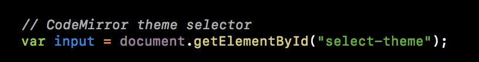
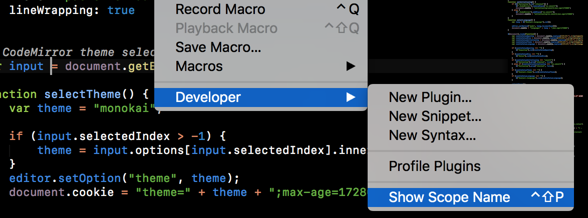
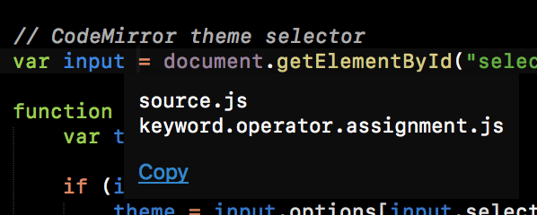
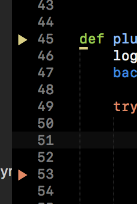

Settings
========

The settings are documented in the default settings file, so you can refer to
them while editing your settings.

.. note::

    Settings are checked for correctness, a message will display with errors.
    You need to fix or remove incorrect settings, like typos and deprecated settings.

This page covers some extra tricks and how to work with project specific settings.

Settings stack
--------------
SublimeLinter merges settings from several sources to calculate the value.
Settings are merged in the following order:

#. Default settings
#. User settings
#. :ref:`Project settings <project>` (only "linters" settings)

Styles (colors)
---------------
Colors are applied to highlights and gutter icons using **scopes**.

Scopes are how Sublime Text manages color.
Regions of code (and sections of the gutter) are labelled with scopes.
You can think of scopes as class names in an HTML file.
These scopes then receive color from the color scheme, which is kinda like a CSS stylesheet.

SublimeLinter expects the scopes ``markup.warning`` and ``markup.error`` to get
correct colors from most color schemes.
We have some fallbacks, and SublimeText > 3149 helps us with scopes like ``region.redish``.

However, sometimes that doesn't work and your icon is white.
In this case you need to use a scope that *does* get the color you want.

Take this code snippet as a starting point to exact colors from:

If I put the cursor just before the ``=`` I can then use the
"Tools > Developer > Show Scope Name" menu item to find out what scope that is:

So, let's hit "copy" here and put that into the "scope" for errors.
Do the same thing for the yellowish color in ``getElementById``.
This gets me the following styles:

.. code-block:: json

    {
        "styles": [
            {
                "mark_style": "stippled_underline",
                "priority": 1,
                "scope": "source.js meta.function-call.method.js support.function.dom.js",
                "icon": "pointer",
                "types": [
                    "warning"
                ]
            },
            {
                "mark_style": "stippled_underline",
                "priority": 1,
                "scope": "source.js meta.block.js keyword.operator.assignment.js",
                "icon": "pointer",
                "types": [
                    "error"
                ]
            }
        ]
    }

Which looks like this:

.. _project:

Project settings
----------------
Only the "linters" settings in can be changed in a project.
All other settings can only be changed in your user settings.

SublimeLinter project settings are defined by a ``"SublimeLinter"`` object
within Sublime Text's sublime-project file.

.. note::

    Read more about project setting in
    `Sublime Text's documentation <https://www.sublimetext.com/docs/3/projects.html>`_.

Here is an example project settings file where the flake8 linter has been disabled:

.. code-block:: json

    {
        "folders":
        [
            {
                "path": "."
            }
        ],
        "SublimeLinter":
        {
            "linters":
            {
                "flake8": {
                    "disable": true
                }
            }
        }
    }

.. note::

    Do not put the ``"SublimeLinter"`` object inside a ``"settings"`` object,
    or anywhere else but directly in the root object of the sublime-project file.

.. _settings-expansion:

Settings Expansion
------------------
After the settings have been merged, SublimeLinter iterates over all settings values and expands any strings.
This uses Sublime Text's `expand_variables` API,
which uses the ``${varname}`` syntax and supports placeholders (``${varname:placeholder}``).
Placeholders are resolved recursively (e.g. ``${XDG_CONFIG_HOME:$HOME/.config}``).

To insert a literal ``$`` character, use ``\\$``.

The following case-sensitive variables are provided:

- ``packages``
- ``platform``
- ``file``
- ``file_path``
- ``file_name``
- ``file_base_name``
- ``file_extension``
- ``folder``
- ``project``
- ``project_path``
- ``project_name``
- ``project_base_name``
- ``project_extension``
- all environment variables

.. note::

    See the `documentation on build systems <https://www.sublimetext.com/docs/3/build_systems.html#variables>`_
    for an explanation of what each variable contains.

We enhanced the expansion for ``folder``.
It now attempts to guess the correct folder if you have multiple folders open in a window.

Additionally, ``~`` will get expanded using
`os.path.expanduser <https://docs.python.org/3/library/os.path.html#os.path.expanduser>`_.

