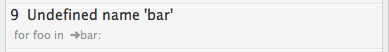

.. include:: defines.inc

Navigating Errors
==================
If errors occur during linting, there are several ways available to quickly navigate through them. There are three commands for navigating errors: ``Next Error``, ``Previous Error``, and ``Show All Errors``.

.. note::

   These commands do **not** lint the current view, they only navigate. If your :doc:`lint mode <lint_modes>` is not **background**, you will have :ref:`manually lint <manually-linting>` if you want to see the lint errors for the current state of the file.

Accessing navigation commands
-----------------------------
You can access these commands in several ways.

**Command Palette**
:raw-html:` `
Bring up the |_cmd| and type :kbd:`next`, :kbd:`previous`, or :kbd:`show`. Among the commands you should see ``SublimeLinter: Next Error``, ``SublimeLinter: Previous Error``, or ``SublimeLinter: Show All Errors``. If the command is not highlighted, use the keyboard or mouse to select it.

**Tools menu**
:raw-html:` `
At the bottom of the Sublime Text ``Tools`` menu, you will see a ``SublimeLinter`` submenu. Select ``SublimeLinter > Next Error``, ``SublimeLinter > Previous Error``, or ``SublimeLinter > Show All Errors``.

**Context menu**
:raw-html:` `
If you right-click (or Control-click on OS X) within a file view, you will see a ``SublimeLinter`` submenu at the bottom of the context menu. Select ``SublimeLinter > Next Error``, ``SublimeLinter > Previous Error``, or ``SublimeLinter > Show All Errors``.

**Keyboard**
:raw-html:` `
You can also use the keyboard to access the navigation commands.

=============== ======================= ====================
Command         Mac OS X                Linux/Windows
=============== ======================= ====================
Next Error      Command+Control+E       Control+K, n
Previous Error  Command+Control+Shift+E Control+K, p
Show All Errors Command+Control+A       Control+K, a
=============== ======================= ====================

If there are any errors in the current view, the next/previous error will be selected, or all errors will be displayed in a Quick Panel. If there are no errors, an alert will appear which indicates there are no errors.

.. note::

   If the :ref:`"wrap_find" <wrap_find>` setting is ``false``, the search for the next/previous error will stop at the bottom/top of the view.

.. _showing-all-errors:

Showing all errors
------------------
When you select the ``Show All Errors`` command, all errors in the view are displayed in a Quick Panel. Each item displays the line number and error message on the first line, and the source code on the second line:

Note that a ➜ is inserted in the source code at the position where the error occurs.

Selecting an error and typing :kbd:`Return/Enter` or clicking on an error navigates directly to that error.

Making warnings passive
-----------------------
If you don't want warnings to be displayed in the ``Show All Errors`` Quick Panel, you can make use of the ``Make Warnings Passive`` command to not have them included in the window. This command determines if the :ref:`"passive_warnings" <passive_warnings>` setting is ``true`` or ``false``. You can access this command in several ways.

**Command Palette**
:raw-html:` `
Bring up the |_cmd| and type :kbd:`warnings`. Among the commands you should see ``SublimeLinter: Make Warnings Passive``, or if it is already turned on you should see ``SublimeLinter: Don't Make Warnings Passive``. If the command is not highlighted, use the keyboard or mouse to select it.

**Tools menu**
:raw-html:` `
At the bottom of the Sublime Text ``Tools`` menu, you will see a ``SublimeLinter`` submenu. Select ``SublimeLinter > Make Warnings Passive``.

**Context menu**
:raw-html:` `
If you right-click (or Control-click on OS X) within a file view, you will see a ``SublimeLinter`` submenu at the bottom of the context menu. Select ``SublimeLinter > Make Warnings Passive``..

.. note::

   If the :ref:`"passive_warnings" <passive_warnings>` setting is ``true``, warnings will still be visible in the gutter and view.
